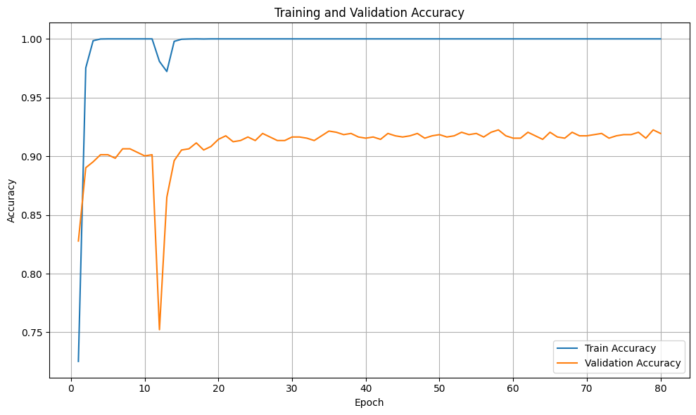
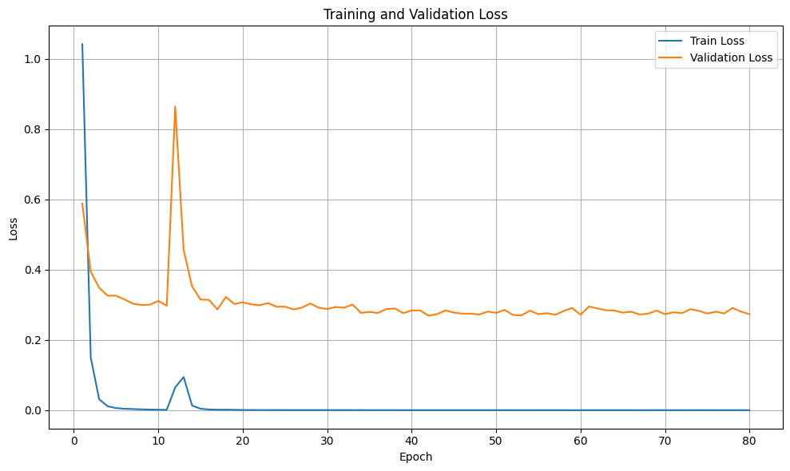
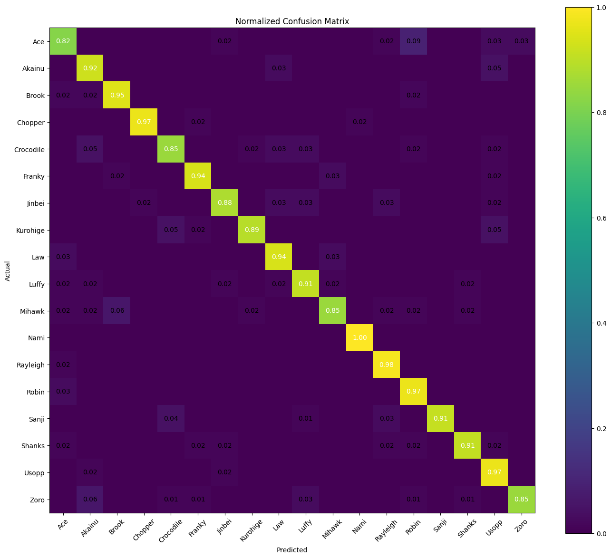
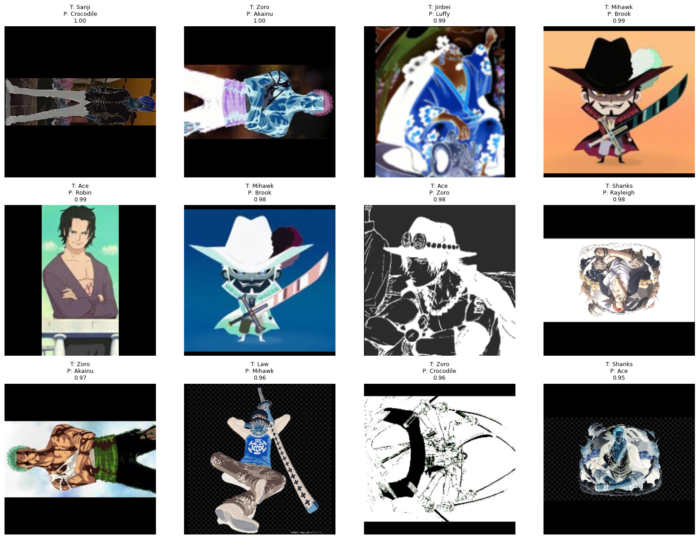

# Classification-of-One-Piece-characters-using-ResNet18

Image classification of One-Piece characters using transfer learning and ResNet18.

---

## Overview

This project implements an image classification pipeline for recognizing 18 different One-Piece characters using a pretrained ResNet18 model and transfer learning techniques.

The project includes:
- data preprocessing,
- image normalization,
- transfer learning with fine-tuning,
- model evaluation,
- confusion matrix analysis,
- visualization of training metrics,
- analysis of highly confident misclassifications.

The model was trained and evaluated using PyTorch.

---

## Dataset

The dataset contains 18 character classes from the One-Piece universe.

Each class contains approximately 650 images:
- original images,
- rotated images,
- color-inverted images,
- other transformed variations.

Images derived from the same original image were grouped together during dataset splitting in order to reduce data leakage between training, validation, and test sets.

Dataset source:
- Public Kaggle dataset

---

## Model Architecture

The project uses a pretrained ResNet18 model from `torchvision.models`.

Transfer learning strategy:
- freeze pretrained layers,
- replace final classification layer,
- fine-tune deeper layers (`layer3` and `layer4`).

Final classification layer:

```python
model.fc = nn.Linear(num_features, NUM_CLASSES)
```

Number of classes:
- 18

---

## Technologies

- Python 3.10
- PyTorch
- Torchvision
- OpenCV
- NumPy
- Matplotlib
- Scikit-learn

---

## Training Configuration

- Optimizer: Adam
- Loss Function: CrossEntropyLoss
- Scheduler: StepLR
- Epochs: 80
- Batch Size: 32

The model was trained using multiple random seeds:
- 42
- 123
- 777

---

## Results

Best validation accuracy:
- 92.24%

Test accuracy:
- 91.72%

The model showed stable performance across different training runs.

---

## Training Curves

### Accuracy



### Loss



---

## Confusion Matrix

Normalized confusion matrix:



---

## Highly Confident Misclassifications

Examples of incorrect predictions where the model was highly confident:



These examples help analyze model weaknesses and understand difficult edge cases.

---

## Running the Project

Install dependencies:

```bash
pip install -r requirements.txt
```

Run training:

```bash
python main.py
```

---

## Notes

This project focuses on:
- transfer learning,
- reproducibility,
- model evaluation,
- error analysis.

The goal was not only to achieve high accuracy, but also to understand model behavior and limitations.

---

## Repository Structure

```text
├── main.py
├── utils.py
├── visualization.py
├── Project Description.docx
├── README.md
└── Selected_Results/
    ├── CM_plot.png
    ├── Top_confident_mistakes.png
    ├── Train_Val_Acc.png
    └── Train_Val_Losses.png
```

---

## Future Improvements

Possible future improvements:
- stronger data augmentation,
- larger backbone architectures,
- better handling of transformed images,
- ONNX export,
- real-time inference pipeline.

---

## License

MIT License
